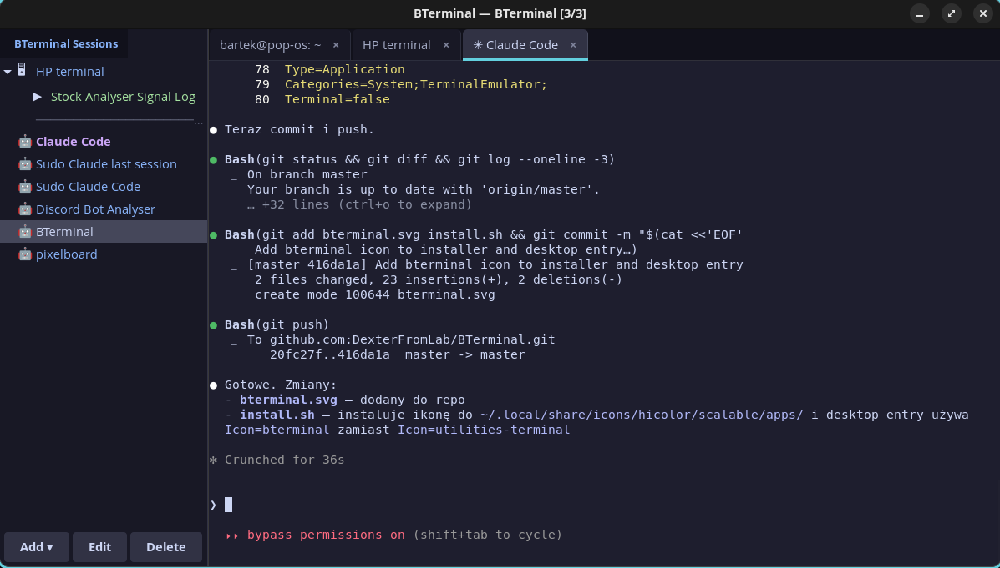

# BTerminal

A GTK 3 terminal emulator built for developers who work with SSH servers and Claude Code. Combines session management, macro automation, a persistent context database, multi-model AI consultation, task orchestration, and git awareness in a single window. Ships with Catppuccin Mocha (dark) and Latte (light) themes.



## Features

### Terminal

- Tabbed interface with VTE terminals, drag-to-reorder, and 10 000-line scrollback
- Local shell tabs (`Ctrl+T`) and SSH connections with saved configs (host, port, user, key file)
- Folder grouping for sessions in the sidebar with collapse, rename, move and ungroup
- Per-session accent colors (10 Catppuccin palette choices)
- Clipboard image detection on paste (`Ctrl+Shift+V`) — saves the image to `copied_images/` in the project directory and pastes the path; right-click option to paste directly into ctx
- Drag-and-drop file URIs into the terminal to paste paths

### Claude Code

- Saved Claude Code session configs: project directory, initial prompt, sudo askpass, resume flag, permission skip
- Sudo elevation via a temporary `SUDO_ASKPASS` helper — password entered once, retried on failure, cleaned up on exit
- Session metrics bar showing live duration, prompts, responses, tokens, cache hit rate, cost and throughput (parsed from Claude Code JSONL output)
- Emoji-tagged tabs for quick visual identification across multiple sessions
- "Open with" context menu — open a project directory in File Manager, VS Code, Zed or a custom command

### Git Panel

A right-side panel that appears only on Claude Code tabs (`Ctrl+G` to toggle). Auto-refreshes every 3 seconds and monitors `.git/` for changes.

Accordion sections: **Branch** (current branch + HEAD), **Changes** (unstaged/untracked with numstat), **Stash**, **LFS/Binary** (detection + setup), **Activity** (recent commits), **Log** (last 20 oneline entries). Includes a `git init` button for uninitialized repos.

### SSH Macros

Multi-step automation sequences bound to sessions. Each step can be a text input, key press (Enter, Tab, Escape, Ctrl+C, Ctrl+D) or a timed delay. Steps are drag-reorderable in the editor and executed sequentially with 50 ms spacing.

### Context Manager (ctx)

SQLite-backed persistent context that survives across Claude Code sessions. Uses FTS5 full-text search and WAL journal mode.

```bash
ctx init myproject "description" /path/to/project
ctx get myproject                      # load project context
ctx get myproject --shared             # include shared (global) entries
ctx set myproject key "value"          # store an entry
ctx append myproject key "more"        # append to an existing entry
ctx shared set preferences "value"     # global context for all projects
ctx summary myproject "what was done"  # save session summary
ctx search "query"                     # full-text search
ctx list                               # list projects
ctx history myproject                  # session history
ctx export                             # export all data as JSON
ctx delete myproject [key]             # delete project or entry
ctx --help
```

The sidebar **Ctx** tab provides a tree view of all projects and entries, a detail/image preview pane, add/edit/delete operations, and selective import/export via JSON with a checkbox UI. A Setup Wizard walks through project registration and can auto-generate `CLAUDE.md`.

Images can be dragged into the ctx tree — they are stored in `~/.claude-context/images/` and indexed in the database.

### Consult (AI Models)

Query external AI models through [OpenRouter](https://openrouter.ai) from the terminal or the sidebar panel.

```bash
consult "question"                     # ask the default model
consult -m google/gemini-2.5-pro "q"   # specific model (full ID with provider prefix)
consult -f code.py "review this"       # attach a file
cat log.txt | consult "what failed?"   # pipe input
consult models                         # list available models
```

The sidebar **Consult** tab manages API keys, enables/disables individual models, sets the default, and fetches the latest model list from OpenRouter. Supports both OpenRouter models and Claude Code native models (Opus, Sonnet, Haiku).

#### Tribunal (Multi-Model Debate)

Adversarial debate across multiple AI models with four roles: Analyst, Advocate, Critic and Arbiter. Configurable round count (1-6), single-pass mode, and per-project presets.

```bash
consult debate "problem"
consult debate "problem" \
  --analyst claude-code/opus \
  --advocate openai/gpt-5-codex \
  --critic deepseek/deepseek-r1 \
  --arbiter claude-code/opus
```

### Task Management

Per-project task lists with hierarchical IDs (1, 1.a, 1.b, 2, ...) and states: open, in_progress, completed.

```bash
tasks list myproject
tasks context myproject                # tasks + next-task instructions
tasks context myproject --session ID   # session-specific claiming
tasks add myproject "description"
tasks add myproject 1 "subtask"        # creates 1.a
tasks done myproject <task_id>
tasks pending myproject
tasks --help
```

The sidebar **Tasks** tab shows a per-project task list with checkboxes, add/edit/delete, and a 2-second auto-refresh poll. An **auto-trigger** system (start/stop buttons) continuously feeds pending tasks to Claude Code sessions — task claims are atomic to prevent collisions in multi-session setups. Auto-trigger flags reset to OFF on every app startup for safety.

### Plugins

Extend BTerminal with Python plugins loaded from `~/.config/bterminal/plugins/`. Each plugin can register a sidebar panel, keyboard shortcuts, and inject extra context into Claude Code session intro prompts.

- Plugins are single `.py` files or packages (directories with `__init__.py`)
- State (enabled/disabled) is persisted in `~/.config/bterminal/plugins.json`
- The sidebar **Plugins** tab lists installed plugins with version, author and status (Loaded / Disabled / Error), plus Add File / Add Folder / Remove actions
- Plugins have their own repositories — install them by cloning into `~/.config/bterminal/plugins/` or using the Add Folder button
- Changes to enable/disable state require a BTerminal restart

Full plugin API and a minimal example: [docs/plugin-spec.md](docs/plugin-spec.md).

### Theme

Toggle between Catppuccin Mocha (dark) and Latte (light) with the sun/moon button. The switch re-colors the terminal palette, sidebar, tabs, dialogs and scrollbars live without restarting.

### Auto-Update

On startup BTerminal checks `origin/master` for new commits. If an update is available it shows a prompt with the new commit list and can pull + reinstall in one click.

### Multi-Window

Launching `bterminal` while another instance is already running opens a new independent window instead of focusing the existing one.

## Requirements

- **Python 3** with PyGObject, GTK 3 and VTE 2.91 bindings
- **Claude Code** CLI — requires an active Claude subscription (Max or Pro); the installer will set it up if missing
- **OpenRouter account** *(optional)* — needed only for the Consult feature; requires API credits at [openrouter.ai](https://openrouter.ai)

## Installation

```bash
git clone https://github.com/DexterFromLab/BTerminal.git
cd BTerminal
./install.sh
```

The installer will:
1. Install system dependencies (`python3-gi`, GTK 3, VTE 2.91, `git`, `git-lfs`)
2. Install Claude Code CLI via npm (installs Node.js first if needed)
3. Copy `bterminal.py`, `ctx`, `consult` and `tasks` to `~/.local/share/bterminal/`
4. Create symlinks in `~/.local/bin/` (`bterminal`, `ctx`, `consult`, `tasks`)
5. Initialize the context database at `~/.claude-context/context.db`
6. Add a desktop entry and icon to the application menu

Use `./install.sh --no-sudo` for a non-root install (sets npm prefix to `~/.npm-global`).

### Manual dependencies (Debian / Ubuntu / Pop!_OS)

```bash
sudo apt install python3-gi gir1.2-gtk-3.0 gir1.2-vte-2.91
```

## Usage

```bash
bterminal
```

The sidebar has five built-in tabs: **Sessions**, **Ctx**, **Consult**, **Tasks** and **Plugins**. Claude Code tabs also get a **Git panel** on the right. Installed plugins can add their own sidebar tabs.

## Keyboard Shortcuts

| Shortcut | Action |
|----------|--------|
| `Ctrl+T` | New local shell tab |
| `Ctrl+Shift+W` | Close current tab |
| `Ctrl+Tab` | Next tab (wraps around) |
| `Ctrl+PageUp` / `Ctrl+PageDown` | Previous / next tab |
| `Ctrl+B` | Toggle sidebar |
| `Ctrl+G` | Toggle Git panel (Claude Code tabs) |
| `F5` | Refresh Git panel |
| `Ctrl+Shift+C` | Copy |
| `Ctrl+Shift+V` | Paste (detects clipboard images) |

## Configuration

Files in `~/.config/bterminal/`:

| File | Contents |
|------|----------|
| `sessions.json` | SSH sessions and macros |
| `claude_sessions.json` | Claude Code session configs |
| `consult.json` | OpenRouter API key, models and tribunal presets |

Context database: `~/.claude-context/context.db`

## License

MIT
