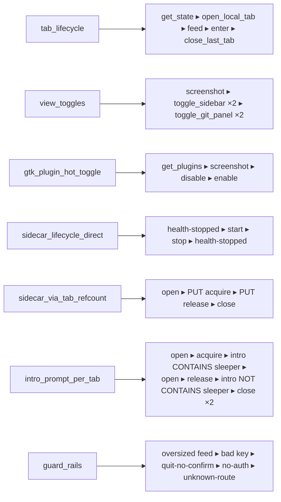

# BTerminal action graph

Catalogue of every REST-driven interaction with `bterminal --debug-rest`,
plus scenarios that walk the application along useful paths. Used by
`tests/test_action_graph.py` to drive end-to-end tests that exercise the
GTK window via the debug REST surface and verify state after every step.

## Files

- `actions.json` — atomic actions (read / mutate). Each entry has a
  `request`, `expect_status`, optional `expect_field`/`expect_json`, and
  an `effect` describing how the abstract state model changes.
- `scenarios.json` — sequences of action IDs forming useful paths.
  Each scenario becomes one parameterized pytest case.
- `runner.py` — interpreter: substitutes `{tabs_count-1}` placeholders,
  performs the HTTP call, asserts status, applies `effect` to the
  in-memory state, optionally captures a screenshot.
- `README.md` (this file) — visual map.

## State model

The runner keeps a small abstract state alongside BTerminal's real state:

| Field | Meaning |
|---|---|
| `tabs_count` | number of `TerminalTab` pages |
| `sidebar_visible` | `app._sidebar_visible` |
| `git_panel_visible` | `app._git_visible` |
| `plugins_loaded` | set of GTK plugin names in `app._plugins` |
| `sidecars_running` | set of sidecar names with live subprocess |
| `tab_plugins` | per-tab `enabled_plugins` (set or null) |

Preconditions in `actions.json` are evaluated against this model so the
runner can pick valid next actions (or skip a step if the precondition
fails — useful when the scenario was rebased onto a different starting
state).

## Action catalogue (28 atomic actions)

```
read              get_health, get_state, get_tabs, get_plugins, get_sidecars,
                  get_window_screenshot, get_debug_log,
                  get_test_sleeper_health_when_stopped,
                  get_last_tab_intro_prompt
tab_lifecycle     open_local_tab, close_last_tab
tab_io            feed_text_to_last_tab, send_enter_to_last_tab
view              toggle_sidebar, toggle_git_panel
plugin_lifecycle  disable_test_panel, enable_test_panel
sidecar_lifecycle start_test_sleeper, stop_test_sleeper
tab_plugins       put_last_tab_plugins_acquire_sleeper,
                  put_last_tab_plugins_release_all
guard             feed_oversized_rejected, key_not_in_whitelist_rejected,
                  quit_without_confirm_rejected,
                  unauthorized_health_returns_401, unknown_route_404
```

## State graph (high level)

```mermaid
graph TD
    boot([BTerminal --debug-rest]) --> S0[1 tab<br/>sidebar visible<br/>0 sidecars running]

    %% View toggles
    S0 -- POST /window/toggle_sidebar --> S0a[sidebar hidden]
    S0a -- POST /window/toggle_sidebar --> S0
    S0 -- POST /window/toggle_git_panel --> S0b[git panel visible]
    S0b -- POST /window/toggle_git_panel --> S0

    %% Tab lifecycle
    S0 -- POST /tabs/local --> S1[2 tabs]
    S1 -- POST /tabs/local --> S2[3 tabs]
    S1 -- POST /tabs/N/feed --> S1
    S1 -- POST /tabs/N/key --> S1
    S2 -- POST /tabs/N/close --> S1
    S1 -- POST /tabs/N/close --> S0

    %% GTK plugin hot toggle
    S0 -- POST /plugins/test_panel/disable --> S0c[test_panel unloaded]
    S0c -- POST /plugins/test_panel/enable --> S0

    %% Sidecar direct lifecycle
    S0 -- POST /sidecars/test_sleeper/start --> S0d[sleeper running]
    S0d -- POST /sidecars/test_sleeper/stop --> S0
    S0d -- GET /sidecars/test_sleeper/health --> S0d

    %% Per-tab refcount path
    S1 -- "PUT /tabs/N/plugins<br/>{enabled:[test_sleeper]}" --> S1r[tab N owns sleeper<br/>refcount=1]
    S1r -- POST /tabs/N/close --> S0
    S1r -- "PUT /tabs/N/plugins<br/>{enabled:[]}" --> S1

    %% Guards (do not change state)
    S0 -. POST /quit  -. 400 .-> S0
    S0 -. GET no-auth -. 401 .-> S0
    S0 -. GET /api/foo -. 404 .-> S0

    %% Shutdown
    S0 -- "POST /quit?confirm=true" --> done([process exits])
```

## Scenarios (7 named walks)



## Running

```bash
pytest tests/test_action_graph.py -v
```

Each scenario is one pytest parameter. Snapshots from `snapshot:true` steps
land in `/tmp/action-graph-{scenario}-{step}.png` for post-hoc inspection.
A failed assertion aborts the scenario but leaves the snapshots.

## Adding actions

1. Append an entry to `actions.json` with a unique `id`, `request`,
   `expect_status`, and `effect` (string evaluated by `runner.py`).
2. Optionally reference it from a scenario.
3. The runner picks it up automatically — no Python changes required for
   simple endpoints.
